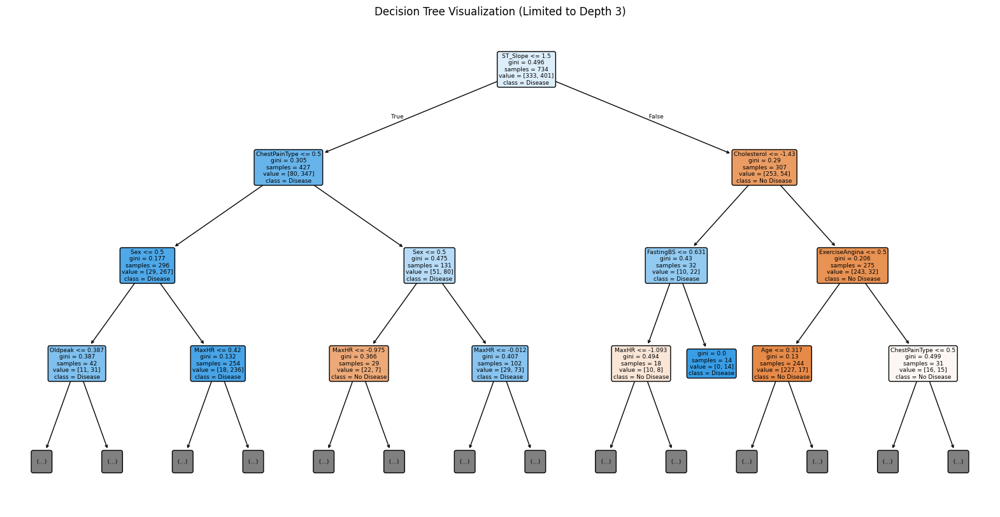
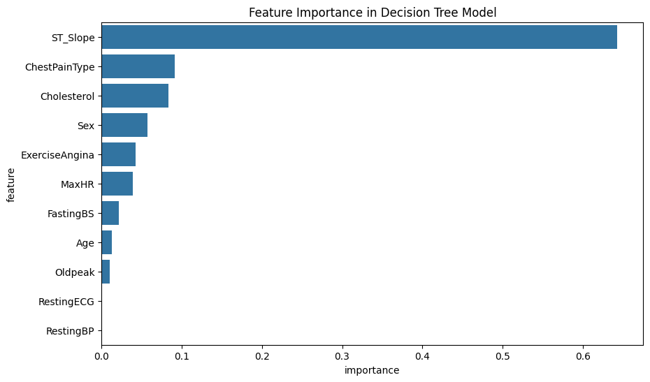
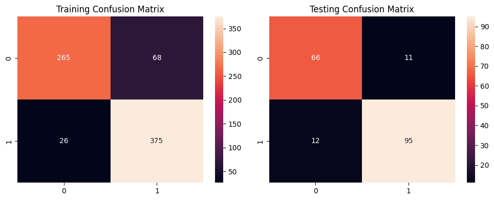
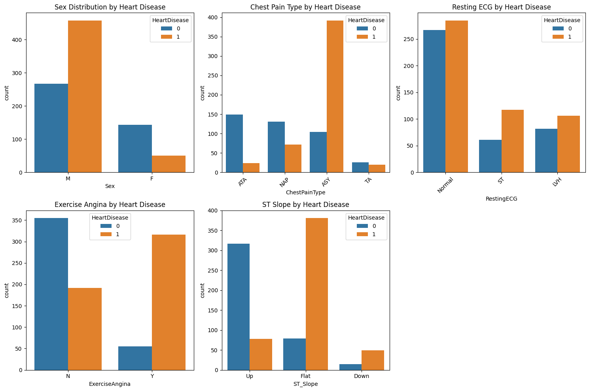

# Interpretable Heart Disease Prediction with Decision Trees (CART)

Predicts whether a patient has heart disease from 11 routine clinical measurements, using a decision tree that a clinician can read from top to bottom. The project follows the CRISP-DM process from start to finish and is written up as a short IEEE-format paper.

**Result: 88% accuracy on unseen patients from a tree only four levels deep.**



## Data

- **Source:** [Heart Failure Prediction Dataset](https://www.kaggle.com/datasets/fedesoriano/heart-failure-prediction) (fedesoriano, Kaggle), which combines five UCI heart disease datasets
- **Size:** 918 patients, 11 features: age, sex, chest pain type, resting blood pressure, cholesterol, fasting blood sugar, resting ECG, maximum heart rate, exercise-induced angina, Oldpeak (ST depression) and ST slope
- **Target:** heart disease yes/no (55% positive), with no missing values

## Approach (CRISP-DM)

1. **Business understanding:** clinicians need predictions they can explain, so interpretability is a requirement, not an extra.
2. **Data understanding:** looked at distributions and at how each categorical feature relates to the outcome.
3. **Preparation:** label-encoded the categorical features, standardised the numeric ones and used a stratified 80/20 split (734 training and 184 test patients).
4. **Modelling:** a CART decision tree tuned with `GridSearchCV` over the split criterion (Gini vs entropy), maximum depth and minimum samples per split and leaf. The best settings were Gini, depth 4, and a minimum of 4 samples per leaf.
5. **Evaluation:** classification report, confusion matrices, 5-fold cross-validation, and feature importance with clinical context.

## Results

| Test set (184 patients) | Precision | Recall | F1 |
|---|---|---|---|
| No heart disease | 0.85 | 0.86 | 0.85 |
| Heart disease | 0.90 | 0.89 | 0.89 |
| **Accuracy** | | | **0.88** |

- The model correctly identified **95 of 107** patients with heart disease and 66 of 77 without.
- 5-fold cross-validation averaged **80.8%** (± 0.109), so results vary between splits. See the next steps below.

**What drives the prediction:**

| Feature | Importance |
|---|---|
| ST slope | 0.643 |
| Chest pain type | 0.091 |
| Cholesterol | 0.083 |
| Sex | 0.057 |
| Exercise-induced angina | 0.042 |

A flat or downward ST slope is by far the strongest signal. This fits clinical knowledge, since ST-segment changes on an ECG are a standard diagnostic indicator. Asymptomatic chest pain and exercise-induced angina are also closely linked with heart disease in the data.

| Feature importance | Confusion matrices |
|---|---|
|  |  |



## Run it

```bash
git clone https://github.com/mu3dhali/Interpretable-Heart-Disease-Prediction-CRISP-DM-CART.git
cd Interpretable-Heart-Disease-Prediction-CRISP-DM-CART
pip install -r requirements.txt
jupyter notebook heart_disease_prediction_cart.ipynb
```

## Files

| File | Contents |
|---|---|
| `heart_disease_prediction_cart.ipynb` | Full analysis: EDA, preprocessing, tuning, evaluation, tree and feature importance |
| `data/heart.csv` | Dataset (918 patients) |
| `docs/heart-disease-prediction-cart-paper.pdf` | Two-page IEEE-format paper: research questions, related work, method and results |
| `images/` | Figures from the notebook |

## Next steps

- Use repeated stratified cross-validation to measure how stable the model is.
- Compare with ensembles such as random forest and gradient boosting, and keep them explainable with SHAP.
- Treat zero cholesterol and blood pressure readings as missing values, since the dataset records some unknown values as 0.

## Skills shown

CRISP-DM · decision trees (CART) · hyperparameter tuning with GridSearchCV · cross-validation · model interpretability · EDA with pandas and seaborn · scientific writing in IEEE format

---

**Muadh Ali Abed** · [LinkedIn](https://www.linkedin.com/in/muadh-abed-603ba024a) · [GitHub](https://github.com/mu3dhali)
